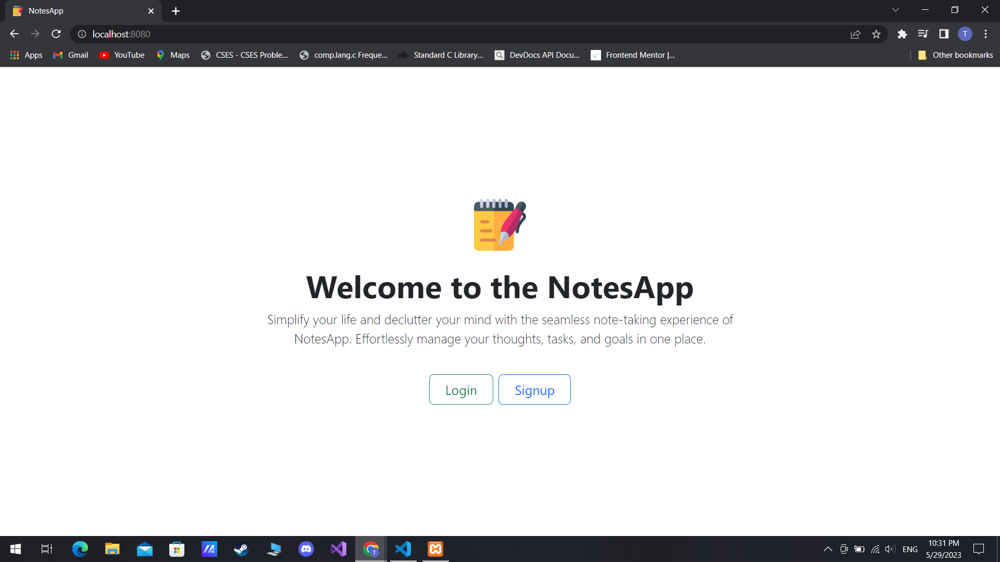
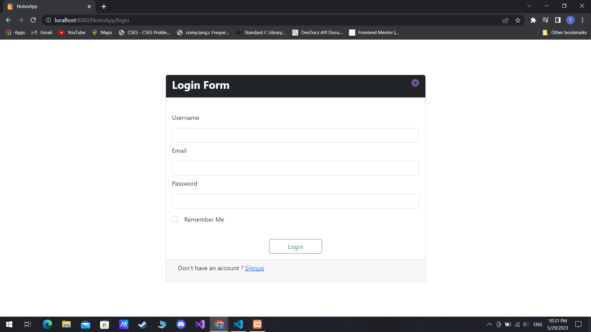
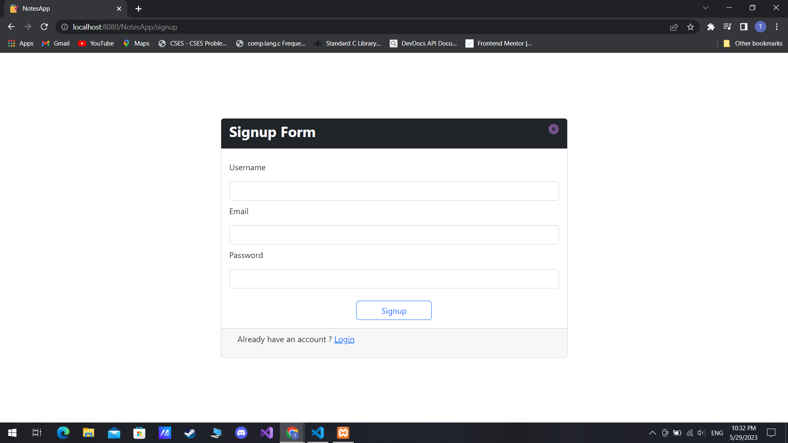
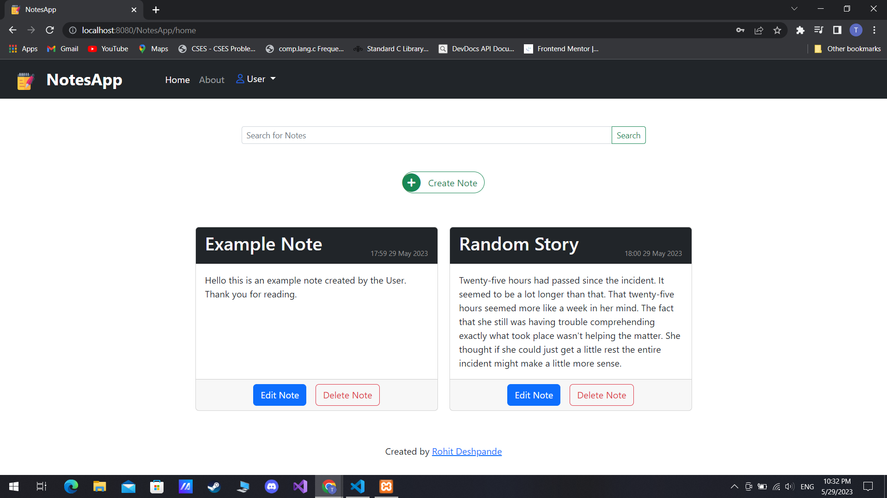
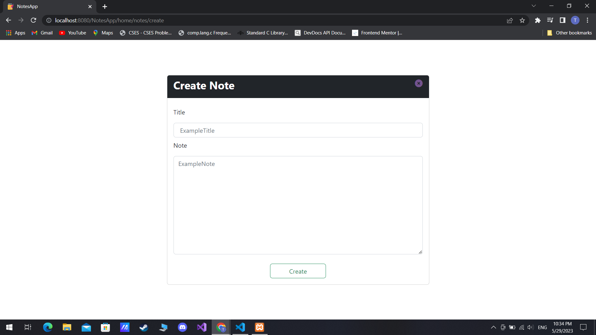
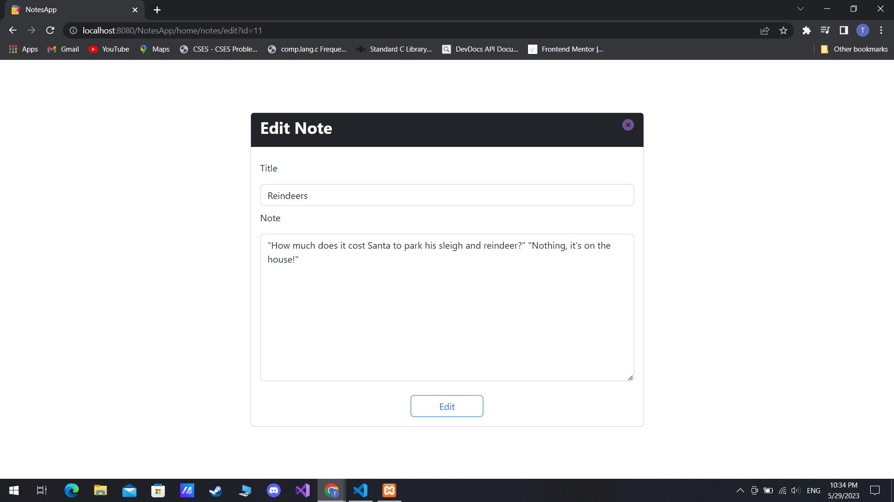
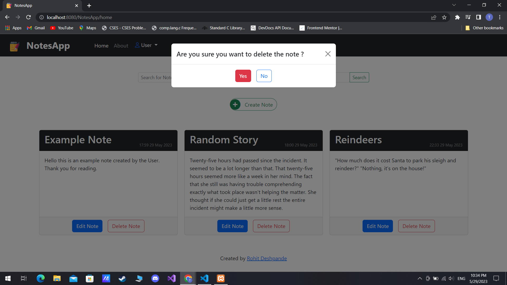
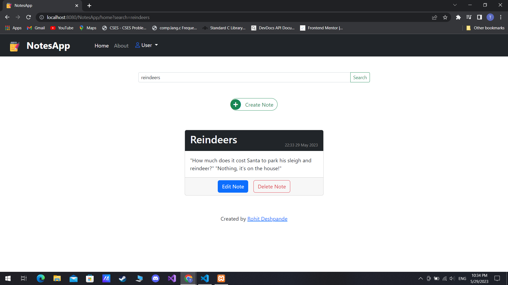
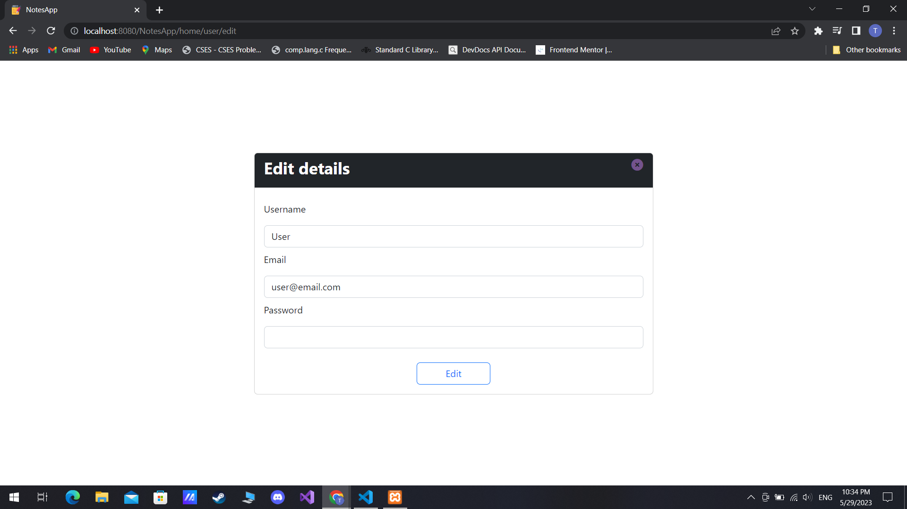
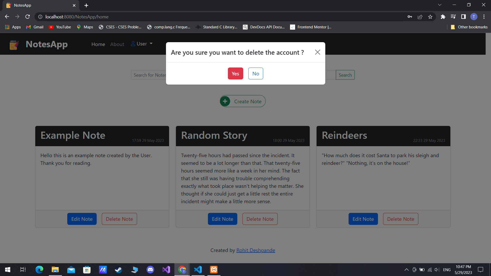

<p align="center"></p>
&nbsp;&nbsp;&nbsp;&nbsp;&nbsp;&nbsp;&nbsp;&nbsp;&nbsp;&nbsp;&nbsp;&nbsp;&nbsp;&nbsp;&nbsp;&nbsp;&nbsp;&nbsp;&nbsp;
<div style="display: inline-block;">


[](https://opensource.org/licenses/MITs)

</div>

# NotesApp - Overview

This is a simple NotesApp which allows the user to signup/login and create, view, update, delete and search notes.

## :pushpin: Table of Contents

- [Tech Stack](#tech-stack)
- [Features](#features)
- [Setting up Project](#setting-up-project)
- [Login details](#login-details)
- [Screenshots](#screenshots)
- [Contributing](#contributing)

## :pushpin: Tech Stack

- Frontend
  - HTML
  - CSS
  - Bootstrap
  - Javascript
- Backend
  - PHP
- Database
  - MySQL

## :pushpin: Features

- Custom Mini MVC architecture used.
- User Login and Signup with remember me using custom tokens.
- CRUD operations on Notes.
- Editing and Deleting user account.

## :pushpin: Setting up Project

**NotesApp** firstly requires a installation of PHP 5.4+ preferably over PHP 7 since we use the built-in server.

You may also install XAMPP as it provides the complete package (PHP,MySQL)

After installation import **notesapp.sql** into your database

Change the Existing database details from **app/core/Database.php** to your database.

```php
$hostname = 'localhost'; // Add your Host name
$port = '3306'; //Add your Port number
$db = 'notesapp'; // Add your db name
$user = 'root'; // Add user
$password = ''; // Add password
$this->pdo = new PDO("mysql:host=$hostname;port=$port;dbname=$db", "$user", "$password");


```

Change directory

```bash
cd public
```

Run the php in-built server

```bash

php -S localhost:8080

```

> **_NOTE:_** You may use the XAMPP server too, but certain changes would need to be made. Firstly place the project in htdocs folder , also change the paths of the routes in index.php in public folder and other links as well. You may also need to change the references of styles and images to './' from just '/'.

## :pushpin: Login details

User login -

- Username : User
- Email : user@email.com
- Password : user123#

## :pushpin: Screenshots

### :round_pushpin: Landing



### :round_pushpin: Login



### :round_pushpin: Signup



### :round_pushpin: Home



### :round_pushpin: Create Note



### :round_pushpin: Edit Note



### :round_pushpin: Delete Note



### :round_pushpin: Search Note



### :round_pushpin: Edit User



### :round_pushpin: Delete User



## :pushpin: Contributing

All are welcome to review the code and contribute to it, I certainly know for now there are many loopholes and code repititions I've made which can be further improved. With time I will be solving those issues and adding a few more features. Feel free to raise any issues or improve upon the above areas, or even add new features.
